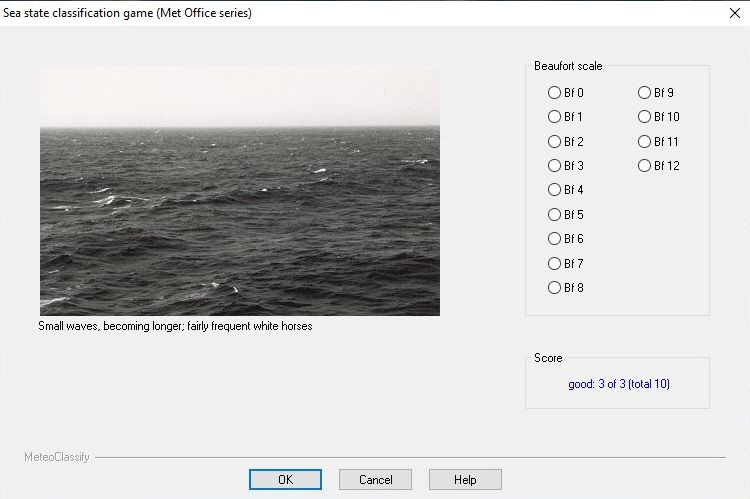

# MeteoClassify

**MeteoClassify** is a training application developed by the Royal Netherlands Meteorological Institute (KNMI) for marine meteorological observers.  
It allows users to test and improve their skills in recognizing:

- Cloud types  
- Sea states  
- Ice conditions  

The tool is designed for both operational observers and trainees who want to practice in a realistic and interactive environment.

---

## 🌍 Project Links

- 🔗 **SourceForge (US) Download Page**  
  [https://sourceforge.net/projects/turbowin/files/MeteoClassify/](https://sourceforge.net/projects/turbowin/files/executables_windows/)

- 🛠️ **Codeberg (Germany) Download Page**  
  [https://codeberg.org/Martin_Stam/TurboWin](https://codeberg.org/Martin_Stam/TurboWin)  
  

---

## 📷 Screenshot

---

## 🧾 Changelog

Recent version: **2.2.0**  

---

## 👤 Developer and maintainer

**Martin Stam**  
Royal Netherlands Meteorological Institute (KNMI)

---

## 📜 License

This project is released as **freeware** for training and educational purposes.  
See included documentation for terms of use.
